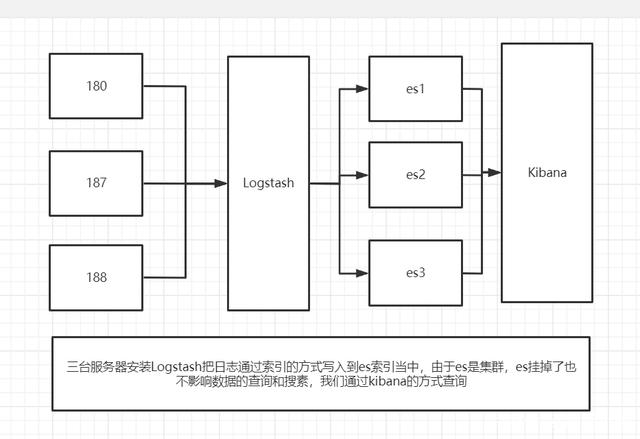

### ELK 安装



#### Elasticsearch

[下载地址/文档](https://www.elastic.co/cn/downloads/elasticsearch)

```
docker pull docker.elastic.co/elasticsearch/elasticsearch:8.0.0
```


> 从Elasticsearch 8.0开始，默认启用安全性。启用安全保护后，弹性堆栈安全功能要求对传输网络层进行TLS加密，否则您的群集将无法启动。

1. 为Elasticsearch和Kibana创建一个新的docker网络

   ```
   docker network create elastic
   ```

   

2. 在Docker中启动Elasticsearch。为生成一个密码弹性的用户和终端的输出，以及用于注册Kibana的注册令牌。

   ```
   docker run --restart=always -d --name es01 --net elastic -p 9200:9200 -p 9300:9300 -it docker.elastic.co/elasticsearch/elasticsearch:8.0.0
   ```

   

3. 复制生成的密码和注册令牌，并将其保存在安全位置。这些值仅在首次启动Elasticsearch时显示。

   ```
   -> Elasticsearch security features have been automatically configured!
   -> Authentication is enabled and cluster connections are encrypted.
   
   # 账号：elastic；初始密码：+x96YH3NDGmxG-aQ4M8P；重置密码命令：bin/elasticsearch-reset-password -u elastic
   ->  Password for the elastic user (reset with `bin/elasticsearch-reset-password -u elastic`):
     +x96YH3NDGmxG-aQ4M8P
   
   # ca证书密钥：41696e2dd0dca56e7b74b06bf5b2e002b77bce150d68915a0dbb936124530f79
   ->  HTTP CA certificate SHA-256 fingerprint:
     41696e2dd0dca56e7b74b06bf5b2e002b77bce150d68915a0dbb936124530f79
   
   # kibana初始化注册密钥：
   eyJ2ZXIiOiI4LjEuMiIsImFkciI6WyIxNzIuMTguMC4yOjkyMDAiXSwiZmdyIjoiNDE2OTZlMmRkMGRjYTU2ZTdiNzRiMDZiZjViMmUwMDJiNzdiY2UxNTBkNjg5MTVhMGRiYjkzNjEyNDUzMGY3OSIsImtleSI6IlJJN3pEWUFCYVlPRkpUUmxpNkhSOk9yWkJqc0gxU2txRmRmVmVrMFdYd1EifQ==
   ->  Configure Kibana to use this cluster:
   * Run Kibana and click the configuration link in the terminal when Kibana starts.
   * Copy the following enrollment token and paste it into Kibana in your browser (valid for the next 30 minutes):
     eyJ2ZXIiOiI4LjEuMiIsImFkciI6WyIxNzIuMTguMC4yOjkyMDAiXSwiZmdyIjoiNDE2OTZlMmRkMGRjYTU2ZTdiNzRiMDZiZjViMmUwMDJiNzdiY2UxNTBkNjg5MTVhMGRiYjkzNjEyNDUzMGY3OSIsImtleSI6IlJJN3pEWUFCYVlPRkpUUmxpNkhSOk9yWkJqc0gxU2txRmRmVmVrMFdYd1EifQ==
   
   -> Configure other nodes to join this cluster:
   * Copy the following enrollment token and start new Elasticsearch nodes with `bin/elasticsearch --enrollment-token <token>` (valid for the next 30 minutes):
     eyJ2ZXIiOiI4LjEuMiIsImFkciI6WyIxNzIuMTguMC4yOjkyMDAiXSwiZmdyIjoiNDE2OTZlMmRkMGRjYTU2ZTdiNzRiMDZiZjViMmUwMDJiNzdiY2UxNTBkNjg5MTVhMGRiYjkzNjEyNDUzMGY3OSIsImtleSI6IlFvN3pEWUFCYVlPRkpUUmxpNkhMOlMzYzVYdWExUkkyWFUtdFZ4U0tENlEifQ==
   
     If you're running in Docker, copy the enrollment token and run:
     `docker run -e "ENROLLMENT_TOKEN=<token>" docker.elastic.co/elasticsearch/elasticsearch:8.1.2`
   
   ```

   1. 如果您需要重置的密码`弹性的`用户或其他内置用户，运行[`弹性搜索-重置-密码`](https://www.elastic.co/guide/en/elasticsearch/reference/current/reset-password.html)工具。该工具在弹性搜索中可用`/bin`Docker容器的目录。例如

      ```
      docker exec -it es01 /usr/share/elasticsearch/bin/elasticsearch-reset-password -u elastic
      # Password for the [elastic] user successfully reset.
      # New value: 4GlsHFPF1kbh8_i4*A3I
      ```

      

4. 复制`http_ca.crt`从Docker容器到本地机器的安全证书。

   ```
   docker cp es01:/usr/share/elasticsearch/config/certs/http_ca.crt .
   ```

   

5. 打开一个新的终端，使用`http_ca.crt`从Docker容器中复制的文件。输入的密码`弹性的`出现提示时的用户。

   ```
   curl --cacert http_ca.crt -u elastic https://localhost:9200
   ```

   

6. **生成注册令牌**

   注册令牌的有效期为30分钟。如果需要生成新的注册令牌，请运行[`弹性搜索-创建-注册-令牌`](https://www.elastic.co/guide/en/elasticsearch/reference/current/create-enrollment-token.html)现有节点上的工具。该工具在弹性搜索中可用`容器`docker容器的目录。

   例如，在现有的上运行以下命令`es01`为新的弹性搜索节点生成注册令牌的节点:

   ```
   docker exec -it es01 /usr/share/elasticsearch/bin/elasticsearch-create-enrollment-token -s node
   
   # eyJ2ZXIiOiI4LjEuMiIsImFkciI6WyIxNzIuMTguMC4yOjkyMDAiXSwiZmdyIjoiNDE2OTZlMmRkMGRjYTU2ZTdiNzRiMDZiZjViMmUwMDJiNzdiY2UxNTBkNjg5MTVhMGRiYjkzNjEyNDUzMGY3OSIsImtleSI6IklfQzhEb0FCWmlRQnRCNGFiLVRuOnlwMzZET0Y0VHAtNzd1SC1yMUYzbGcifQ==
   
   ```

   

7. 在启动第一个节点的终端中，复制generatedenrollment令牌以添加新的Elasticsearch节点。在您的新节点上，启动Elasticsearch并包含生成的注册令牌。

   ```
   docker run -e ENROLLMENT_TOKEN="<token>" --name es02 --net elastic -it docker.elastic.co/elasticsearch/elasticsearch:8.1.2
   
   # docker run -e ENROLLMENT_TOKEN="eyJ2ZXIiOiI4LjEuMiIsImFkciI6WyIxNzIuMTguMC4yOjkyMDAiXSwiZmdyIjoiNDE2OTZlMmRkMGRjYTU2ZTdiNzRiMDZiZjViMmUwMDJiNzdiY2UxNTBkNjg5MTVhMGRiYjkzNjEyNDUzMGY3OSIsImtleSI6IklmQUpEb0FCWmlRQnRCNGFKdVQ2OlUwODhtejV2U0EtaWowaGlHRVRkOGcifQ==" --name es02 --net elastic -it docker.elastic.co/elasticsearch/elasticsearch:8.1.2
   # 如果失败可能是内存溢出
   ```

#### Logstash

https://www.cnblogs.com/linjiqin/p/12103645.html

#### Kibana

```
docker pull kibana:8.0.0
```

文档地址

https://blog.csdn.net/UbuntuTouch/article/details/122936411?ops_request_misc=%257B%2522request%255Fid%2522%253A%2522164959816216781683947810%2522%252C%2522scm%2522%253A%252220140713.130102334.pc%255Fblog.%2522%257D&request_id=164959816216781683947810&biz_id=0&utm_medium=distribute.pc_search_result.none-task-blog-2~blog~first_rank_ecpm_v1~rank_v31_ecpm-10-122936411.nonecase&utm_term=%E5%AE%89%E8%A3%85&spm=1018.2226.3001.4450

#### 解决问题

vi/vim：容器内无法使用

```
docker exec -it -u 0 容器名称/id /bin/bash
apt-get update
apt-get install vim*
```

> apt-get 在容器内会提示一个路径错误。是因为权限不足。在进入容器时声明权限`-u 0`使用root权限进入。
>
> *apt-get*，是一条linux命令，适用于deb包管理式的操作系统，主要用于自动从互联网的软件仓库中搜索、安装、升级、卸载软件或操作系统。
>
> 此处可以理解centos 使用 yum 安装软件。Ubuntu 使用 apt-get。但是Linux环境下的docker是使用apt-get。包管理跟操作系统无关。