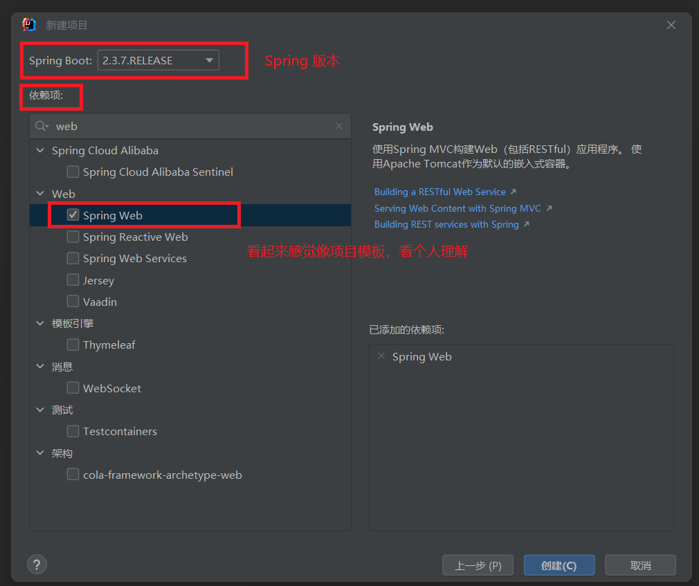

### 安装环境

IDEA  2022.2：下载最新版，密钥百度上有。
mySql：准备好自己测试用的数据库

### 新建项目

必须设置服务器地址。不然很慢其他的不用管太多。我这直接用java11开发。


最开始我还不知道从哪找Spring版本。不能说上面用Spring。我具体用的什么都不知道吧。Spring Wrb是我随机的。看着像就他了。




### 配置maven

使用一些依赖之后，Maven会很卡。必须更换。下面是怎么配置Maven链接。


[Maven的下载安装配置教程（详细图文）_new 杨海波的博客-CSDN博客_maven下载](https://blog.csdn.net/bakelFF/article/details/123049992)

### 项目目录


### 配置swagger

DemoApplication.java

```java
package com.example.demo;

import org.springframework.boot.SpringApplication;
import org.springframework.boot.autoconfigure.SpringBootApplication;

// 程序主文件 @SpringBootApplication好像.net 特性
@SpringBootApplication(scanBasePackages="com.example.demo.controller") // 程序文件的命名空间\包地址
public class DemoApplication {

    public static void main(String[] args) {

        SpringApplication.run(DemoApplication.class, args);
        System.out.println("http://localhost:6001/swagger-ui/index.html#/"); //访问地址
    }

}
```

SwaggerConfig.java

```java
package com.example.demo.config;

import org.springframework.context.annotation.Configuration;
import springfox.documentation.swagger2.annotations.EnableSwagger2;


@Configuration
@EnableSwagger2
public class SwaggerConfig {

}
```

dbHerper.java

```java
package com.example.demo.common;

import com.mysql.jdbc.Connection;

import java.sql.DriverManager;
import java.sql.ResultSet;
import java.sql.SQLException;
import java.sql.Statement;

public class dbHerper {
    private Connection conn = null;

    private void Init() {
        try {
            if (conn == null) {
                conn = (Connection) DriverManager.getConnection("jdbc:mysql://localhost/Demo?" +
                        "user=root&password=123456&characterEncoding=utf-8");
            } else {
                conn = (Connection) DriverManager.getConnection("jdbc:mysql://localhost/Demo?" +
                        "user=root&password=123456&characterEncoding=utf-8");
            }

        } catch (SQLException ex) {

            System.out.println("SQLException: " + ex.getMessage());
            System.out.println("SQLState: " + ex.getSQLState());
            System.out.println("VendorError: " + ex.getErrorCode());
        }
    }

    public ResultSet Serach(String sql) {
        Init();
        ResultSet result = null;
        try {
            Statement statement = conn.createStatement();
            result = statement.executeQuery(sql);
        } catch (SQLException ex) {
            System.out.println("SQLException: " + ex.getMessage());
            System.out.println("SQLState: " + ex.getSQLState());
            System.out.println("VendorError: " + ex.getErrorCode());
        } catch (Exception ex) {
            System.out.println("SQLException: " + ex.getMessage());
        }
        return result;
    }

    public boolean Execute(String sql) {
        Init();
        boolean result=false;
        try {
            Statement statement = conn.createStatement();
            result = statement.execute(sql);
        } catch (SQLException ex) {
            System.out.println("SQLException: " + ex.getMessage());
            System.out.println("SQLState: " + ex.getSQLState());
            System.out.println("VendorError: " + ex.getErrorCode());
        } catch (Exception ex) {
            System.out.println("SQLException: " + ex.getMessage());
        }
        return result;
    }

    public int Update(String sql) {
        Init();
        int result = 0;
        try {
            Statement statement = conn.createStatement();
            result = statement.executeUpdate(sql);
            System.out.println(result);
        } catch (SQLException ex) {
            System.out.println("SQLException: " + ex.getMessage());
            System.out.println("SQLState: " + ex.getSQLState());
            System.out.println("VendorError: " + ex.getErrorCode());
        } catch (Exception ex) {
            System.out.println("SQLException: " + ex.getMessage());
        }
        return result;
    }

}
```

UserController.java

```java
package com.example.demo.controller;

import com.example.demo.common.dbHerper;
import com.example.demo.entity.User;
import com.example.demo.interfaces.ICRUD;
import org.springframework.validation.annotation.Validated;
import org.springframework.web.bind.annotation.*;

import java.sql.ResultSet;

@CrossOrigin//跨域中间件
@Validated
@RestController
@RequestMapping("/user")
public class UserController implements ICRUD<User> {
    @GetMapping(value = "/Search")
    public <User> void Search() {
        dbHerper db = new dbHerper();
        ResultSet set = db.Serach("select * from FrameworkUsers ");
    }

    @PostMapping(value = "/Add")
    public <User> void Add(User user) {
        dbHerper db = new dbHerper();
        ResultSet set = db.Serach("select * from FrameworkUsers ");
    }

    @PostMapping(value = "/Update")
    public <User> int Update(User user) {
        dbHerper db = new dbHerper();
        int result = db.Update("update FrameworkUsers set Name='www1' where id='08da6e38-23ce-4170-8d0a-07807fd0cbfc' ");
        return result;
    }

    @PostMapping(value = "/Delete")
    public <User> void Delete(User user) {

    }
}
```

application.properties

```properties
server.port=6001
spring.application.name=demo
```

Dockerfile

```dockerfile
#项目所依赖的jdk镜像
FROM java:8
#将maven构建好的jar添加到镜像中，第二个为别名
ADD target/*.jar app.jar
#暴露的端口号(和项目端口号等同)
EXPOSE 6000
#镜像所执行的命令
ENTRYPOINT ["java","-jar","/app.jar"]
```

pom.xml

```xml
<?xml version="1.0" encoding="UTF-8"?>
<project xmlns="http://maven.apache.org/POM/4.0.0" xmlns:xsi="http://www.w3.org/2001/XMLSchema-instance"
         xsi:schemaLocation="http://maven.apache.org/POM/4.0.0 https://maven.apache.org/xsd/maven-4.0.0.xsd">
    <modelVersion>4.0.0</modelVersion>
    <!--  公司名称  -->
    <groupId>com.example</groupId>
    <!--  项目\软件 名称  -->
    <artifactId>demo</artifactId>
    <!--  版本  -->
    <version>release</version>
    <!--  名称  -->
    <name>demo</name>
    <!--  介绍  -->
    <description>demo</description>

    <properties>
        <java.version>1.8</java.version>
        <project.build.sourceEncoding>UTF-8</project.build.sourceEncoding>
        <project.reporting.outputEncoding>UTF-8</project.reporting.outputEncoding>
        <spring-boot.version>2.3.7.RELEASE</spring-boot.version>
    </properties>

    <!--  依赖  -->
    <dependencies>
        <dependency>
            <groupId>org.springframework.boot</groupId>
            <artifactId>spring-boot-starter</artifactId>
        </dependency>

        <dependency>
            <groupId>org.springframework.boot</groupId>
            <artifactId>spring-boot-starter-test</artifactId>
            <scope>test</scope>
            <exclusions>
                <exclusion>
                    <groupId>org.junit.vintage</groupId>
                    <artifactId>junit-vintage-engine</artifactId>
                </exclusion>
            </exclusions>
        </dependency>
        <dependency>
            <groupId>io.springfox</groupId>
            <!--  springfox-swagger2  -->
            <artifactId>springfox-swagger2</artifactId>
            <version>3.0.0</version>
        </dependency>
        <dependency>
            <groupId>io.springfox</groupId>
            <!--  springfox-swagger-ui  -->
            <artifactId>springfox-swagger-ui</artifactId>
            <version>3.0.0</version>
        </dependency>
        <dependency>
            <groupId>io.springfox</groupId>
            <artifactId>springfox-boot-starter</artifactId>
            <version>3.0.0</version>
        </dependency>


        <dependency>
            <groupId>org.springframework.boot</groupId>
            <artifactId>spring-boot-starter-web</artifactId>
        </dependency>

        <!--  mysql  -->
        <dependency>
            <groupId>mysql</groupId>
            <artifactId>mysql-connector-Java</artifactId>
            <version>5.1.36</version>
        </dependency>

    </dependencies>
    <!-- 依赖管理 -->
    <!--  依赖管理需要的框架  -->
    <dependencyManagement>
        <dependencies>
            <dependency>
                <groupId>org.springframework.boot</groupId>
                <artifactId>spring-boot-dependencies</artifactId>
                <version>${spring-boot.version}</version>
                <type>pom</type>
                <scope>import</scope>
            </dependency>
        </dependencies>
    </dependencyManagement>
    <!-- 打包 -->
    <!--  应该是打包需要依赖的框架  -->
    <build>
        <plugins>
            <plugin>
                <groupId>org.apache.maven.plugins</groupId>
                <artifactId>maven-compiler-plugin</artifactId>
                <version>3.8.1</version>
                <configuration>
                    <source>1.8</source>
                    <target>1.8</target>
                    <encoding>UTF-8</encoding>
                </configuration>
            </plugin>
            <plugin>
                <groupId>org.springframework.boot</groupId>
                <artifactId>spring-boot-maven-plugin</artifactId>
                <version>2.3.7.RELEASE</version>
                <configuration>
                    <mainClass>com.example.demo.DemoApplication</mainClass>
                </configuration>
                <executions>
                    <execution>
                        <id>repackage</id>
                        <goals>
                            <goal>repackage</goal>
                        </goals>
                    </execution>
                </executions>
            </plugin>
            <!-- 构建docker镜像 -->
            <plugin>
                <groupId>com.spotify</groupId>
                <artifactId>docker-maven-plugin</artifactId>
                <version>1.2.2</version>
                <executions>
                    <execution>
                        <id>build-image</id>
                        <phase>package</phase>
                        <goals>
                            <goal>build</goal>
                        </goals>
                    </execution>
                </executions>
                <configuration>
                    <!-- image 的名字(一定得是小写) -->
                    <imageName>${project.build.finalName}</imageName>
                    <!-- image 的tag, 可以是多个 -->
                    <imageTags>
                        <imageTag>latest</imageTag>
                    </imageTags>
                    <!-- Dockerfile所在的目录 -->
                    <dockerDirectory>${project.basedir}</dockerDirectory>
                    <!-- 复制jar到docker的位置 -->
                    <resources>
                        <resource>
                            <targetPath>/</targetPath>
                            <!--jar 包所在的路径，对应target目录-->
                            <directory>${project.build.directory}</directory>
                            <!-- 包含的jar　-->
                            <include>${project.build.finalName}.jar</include>
                        </resource>
                    </resources>
                    <!-- docker远程地址 -->
                    <dockerHost>http://localhost:2375</dockerHost>
                </configuration>
            </plugin>
        </plugins>
    </build>

</project>

```

这里可能需要重新执行clean。通过package打包。服务器docker 就会有项目的镜像

如果打包提示http 400可能是远程端口不对需要开启。 

docker 运行

```shell
docker run -d --name demo -p 6001:6001 demo-release:latest
```

