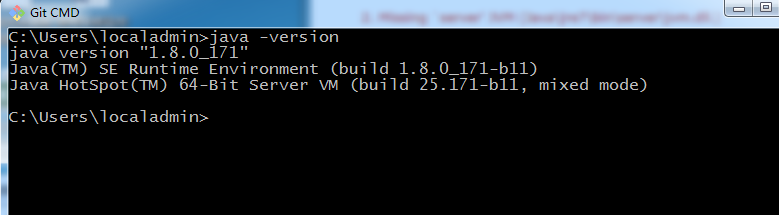
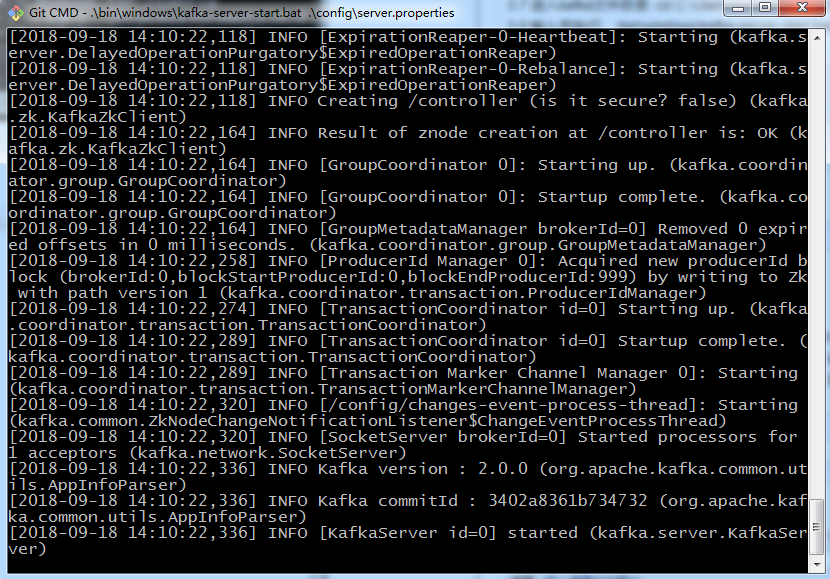
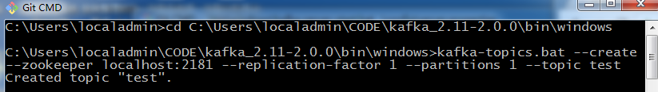
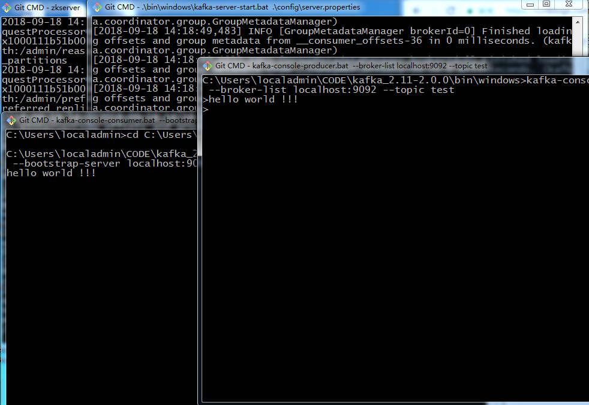

## 安装

[Windows上Kafka运行环境安装 - Niceri - 博客园 (cnblogs.com)](https://www.cnblogs.com/lnice/p/9668750.html)

[WINDOWS上KAFKA运行环境安装](https://www.cnblogs.com/lnice/p/9668750.html)

**1. 安装JDK**

1.1 安装文件：http://www.oracle.com/technetwork/java/javase/downloads/index.html 下载JDK1.2 安装完成后需要添加以下的环境变量（右键点击“我的电脑” -> "高级系统设置" -> "环境变量" ）：

- JAVA_HOME: C:\Program Files\Java\jdk1.8.0_171 (jdk的安装路径)

- Path: 在现有的值后面添加"; %JAVA_HOME%\bin"

1.3 打开cmd运行 "java -version" 查看当前系统Java的版本：

​    

**2. 安装ZOOKEEPER**

Kafka的运行依赖于Zookeeper，所以在运行Kafka之前我们需要安装并运行Zookeeper

2.1 下载安装文件： http://zookeeper.apache.org/releases.html

2.2 解压文件 

2.3 打开zookeeper-3.4.13\conf，把zoo_sample.cfg重命名成zoo.cfg

2.4 从文本编辑器里打开zoo.cfg

2.5 把dataDir的值改成“./zookeeper-3.4.13/data”

2.6 添加如下系统变量：

- ZOOKEEPER_HOME: C:\Users\localadmin\CODE\zookeeper-3.4.13 (zookeeper目录)
- Path: 在现有的值后面添加 ";%ZOOKEEPER_HOME%\bin;"

2.7 运行Zookeeper: 打开cmd然后执行 zkserver

 

cmd 窗口不要关闭

**3. 安装并运行KAFKA**

3.1 下载安装文件： http://kafka.apache.org/downloads.html

3.2 解压文件

3.3 打开kafka_2.11-2.0.0\config

3.4 从文本编辑器里打开 server.properties

3.5 把 log.dirs的值改成 “./logs”

3.6 打开cmd

3.7 进入kafka文件目录: cd C:\Users\localadmin\CODE\kafka_2.11-2.0.0(kafka目录)

3.8 输入并执行: .\bin\windows\kafka-server-start.bat .\config\server.properties

cmd 窗口不要关闭

**4. 创建TOPICS**

4.1 打开cmd 并进入cd C:\Users\localadmin\CODE\kafka_2.11-2.0.0\bin\windows

4.2 创建一个topic： kafka-topics.bat --create --zookeeper localhost:2181 --replication-factor 1 --partitions 1 --topic test

​    

**5. 打开一个PRODUCER：**

​                cd C:\Users\localadmin\CODE\kafka_2.11-2.0.0\bin\windows              

​                kafka-console-producer.bat --broker-list localhost:9092 --topic test              

**6. 打开一个CONSUMER:**

​                cd C:\Users\localadmin\CODE\kafka_2.11-2.0.0\bin\windows              

​                kafka-console-consumer.bat --bootstrap-server localhost:9092 --topic test --from-beginning              

**7. 测试:**

 

